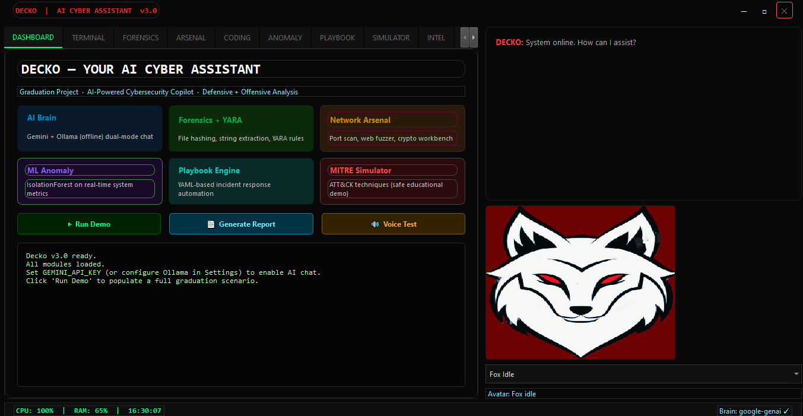
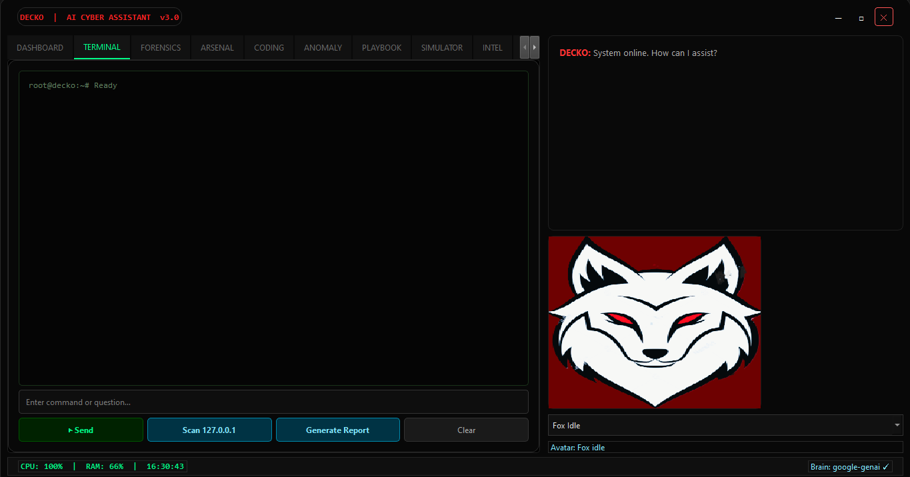
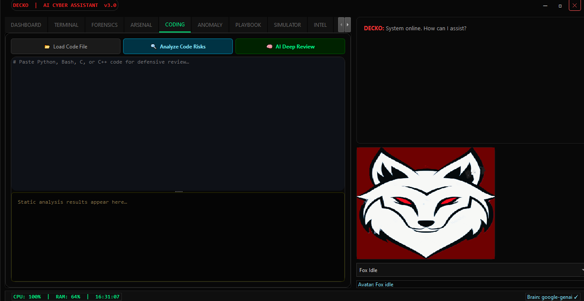
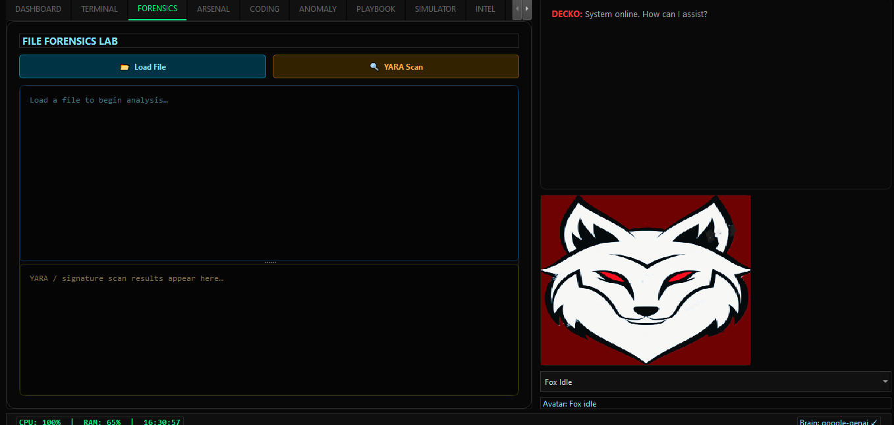
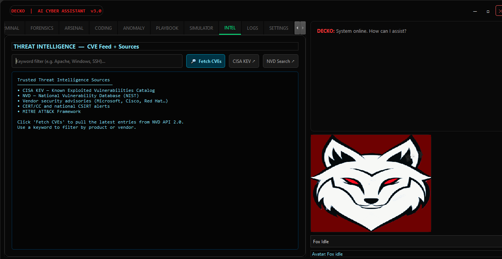
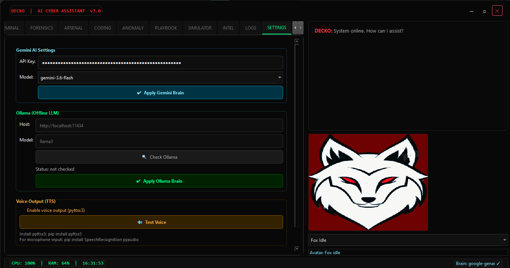
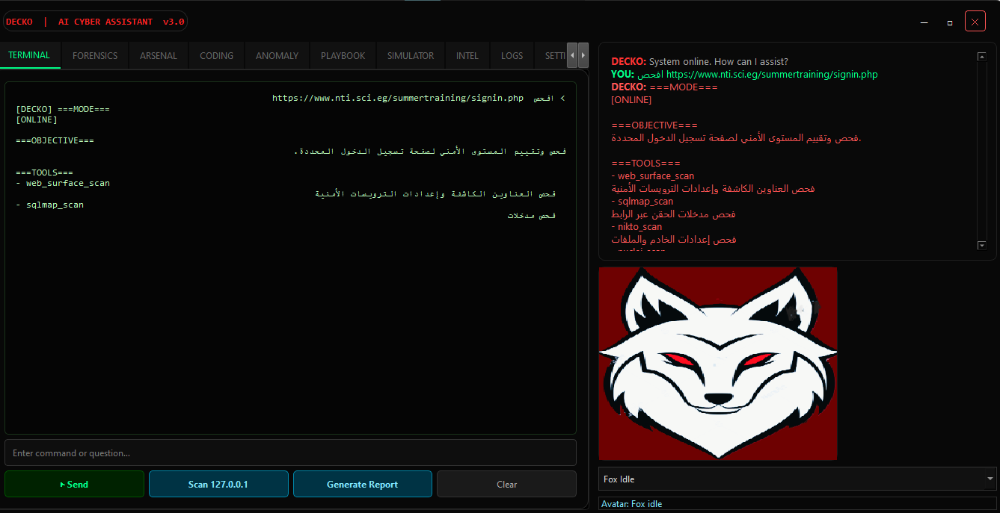
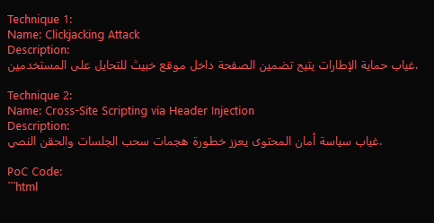
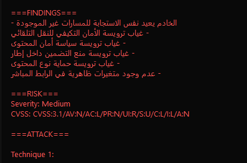

# 🦊 Decko — AI Cyber Assistant v3

Decko is a Windows-first desktop cybersecurity assistant for authorized defensive work, security labs, students, and SOC workflows. It combines an AI assistant with local analysis tools, file forensics, playbooks, anomaly detection, CVE intelligence, and an audit trail.

> Use Decko only on systems and targets you own or have explicit permission to test.

## Screenshots

### Dashboard



| Terminal | Coding review |
|---|---|
|  |  |

| File forensics | Threat intelligence |
|---|---|
|  |  |

| Settings | AI-assisted authorized scan |
|---|---|
|  |  |

| Security findings | Risk summary |
|---|---|
|  |  |

## Features

- Gemini cloud AI and Ollama offline mode
- PyQt6 desktop interface with animated fox avatar
- Network scanning with Nmap support and a built-in fallback
- Web checks with SQLmap, Nikto, Nuclei, Gobuster support, and built-in checks
- File hashing, YARA scanning, and signature-based fallback
- John the Ripper integration for authorized password-audit exercises
- ML anomaly detection using Isolation Forest
- YAML incident-response playbooks
- MITRE ATT&CK educational simulator with a consent gate
- NVD CVE feed, HTML reports, SQLite audit logs, and CSV export
- Optional text-to-speech and speech recognition

## Agent tool use

With the Gemini brain enabled, the main chat is connected directly to Decko's local tools through Gemini automatic function calling. The user can describe the goal naturally; Decko selects the minimum relevant tool, executes it in a background worker, and explains the observed result.

Decko also includes a purpose-built system prompt that defines its identity,
mission, tool-routing policy, authorization checks, evidence rules, and response
format. The prompt teaches the agent when to use each tool, when not to run a
tool, how to avoid fabricated results, and how to explain findings in the
user's language.

Example requests:

```text
Check which security tools are ready on this computer.
Scan 127.0.0.1 and explain the open ports.
Check the authorized site http://localhost for exposed paths.
Search the current CVE feed for Apache.
Scan C:\Samples\test.exe with YARA.
Review this Python code for security risks: ...
```

Active checks require an explicit target. Decko does not invent targets, and tool output is separated from recommendations. Ollama remains available for offline chat; automatic local-tool selection currently uses the `google-genai` brain.

## Download options

The repository includes the maintainable source code and the bundled Windows tools under `DeckoTools/`. The large Nuclei executable is stored with Git LFS, so clone the repository with Git LFS enabled to receive the complete binary.

```powershell
git lfs install
git clone https://github.com/abdelrahmanhossamshaat0001/Decko-Your-AI-Cyber-Assistant.git
```

Windows Security may quarantine security-testing files. In particular, `DeckoTools/nikto-main/program/nikto.pl` could not be committed from this machine because endpoint protection blocked access to it. Download Nikto from its official repository or restore the file only when you understand the risk and intend authorized use.

## Quick start on Windows

1. Install 64-bit Python 3.11 or 3.12 from [python.org](https://www.python.org/downloads/windows/) and enable **Add Python to PATH**.
2. Extract the complete release ZIP to a normal writable directory.
3. Double-click `setup_windows.bat`.
4. Set `GEMINI_API_KEY` for Gemini, or configure Ollama in Decko for offline use.

Manual setup:

```powershell
py -3 -m venv .venv
.venv\Scripts\activate
python -m pip install -r requirements.txt
python verify_installation.py --test-tools
$env:GEMINI_API_KEY = "YOUR_KEY_HERE"
python decko.py
```

Never commit a real API key. A local `.env` file is ignored by Git.

## Linux and macOS

The Python application can run on Linux and macOS, but the bundled external executables are Windows builds. Install native versions of the tools on `PATH` if required.

```bash
python3 -m venv .venv
source .venv/bin/activate
python -m pip install -r requirements.txt
python verify_installation.py --test-tools
export GEMINI_API_KEY="YOUR_KEY_HERE"
python decko.py
```

## Offline mode with Ollama

Install [Ollama](https://ollama.com/), then:

```bash
ollama pull llama3
ollama serve
```

In Decko, open Settings and use host `http://localhost:11434`, model `llama3`, then select **Apply Ollama Brain**.

## External tool status

Decko discovers tools on the system `PATH` and recursively under `DeckoTools/`. Supported ZIP bundles are extracted automatically on first use.

| Tool | Included in Windows release | Notes |
|---|---:|---|
| Nmap | Yes | Some scan types need Npcap, the Microsoft Visual C++ runtime, and administrator rights. |
| SQLmap | Yes | Runs with the active Python interpreter. |
| John the Ripper | Yes | Windows Security may quarantine password-auditing binaries. Restore only if downloaded from the official release and you intend authorized use. |
| Nikto | Yes | Requires Strawberry Perl on `PATH` plus `JSON` and `XML::Writer` (`cpan JSON XML::Writer`). |
| Nuclei | Yes, compressed | Extracts on first use; templates can require an Internet connection. |
| Gobuster | Yes, compressed | Official Windows x64 build; extracts automatically on first use. |
| YARA CLI | Yes | `yara.exe` is included; `yara-python` remains an optional alternative. |

Run this any time to check the current machine:

```powershell
python verify_installation.py --test-tools
```

An optional tool being unavailable does not prevent the main application from starting; Decko falls back where supported and reports the limitation.

For a strict external-tool check, use `python verify_installation.py --test-tools --strict-tools`. This may fail when an optional runtime or antivirus exception is missing even though the main Decko interface can run.

## Project layout

```text
Decko/
├── decko.py
├── tools.py
├── verify_installation.py
├── setup_windows.bat
├── requirements.txt
├── PROMPT_ENGINEERING.md
├── playbooks/
├── yara_rules/
├── fox.gif / fox_idle.gif / fox_talk.gif / fox_think.gif
└── DeckoTools/                 # Release bundle only; ignored by Git
```

`decko_memory.db` is created locally at runtime and is ignored by Git.

## Security and limitations

- No malware generation or unauthorized exploitation is intended.
- Simulations require user consent and operations are logged.
- Tool output is not proof that a target is safe; validate important findings manually.
- Third-party tools keep their own licenses and are not authored by the Decko project.
- A clean static check cannot guarantee every Windows machine, antivirus policy, driver, network, or API configuration. Use `verify_installation.py` after extraction.

## Built by

**Decko Team** · Graduation Project  
*TKBW — Think, Know, Build, Work Smart.*
